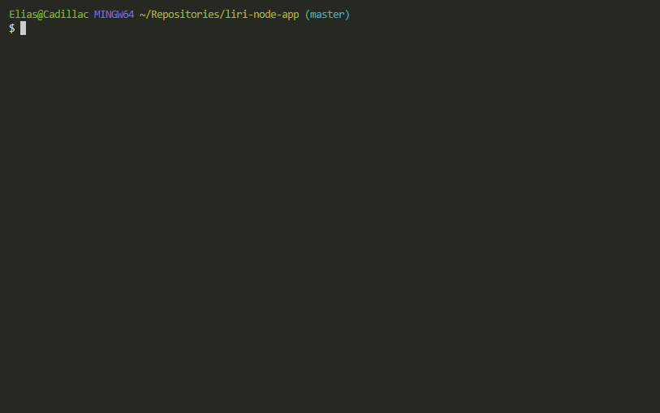

# liri-node-app
#### LIRI is a command line node app that takes in parameters and gives you back data.

Specifically, Liri provides information on concerts, songs, and movies.

Technologies used on this application:

* Node.js

Dependencies:
* [dotenv](https://www.npmjs.com/package/dotenv)
* [axios](https://www.npmjs.com/package/axios)
* [inquirer](https://www.npmjs.com/package/inquirer)
* [moment.js](https://momentjs.com/)

How to use Liri:

Prequisites: 
* you must have node.js installed on your system as that is what Liri runs on.
* you will need a Spotify ID and a Spotify Secret stored in a local .env file in order for this application to run

DISCLAIMER:
This application requires the user to be familiar with node.js and how to run CLI applications.

Steps:

1. download or fork the liri-node-js repository
2. navigate to the repo on your local machine and run `npm install` in order to install the required packages for the application (note: some of the packages are save-dev)

3. From the terminal run the application by running `node app`. 

    Where the capitalised arguments are replaced with your desired search string.

gif examples:
* concert-this:
>

* spotify-this-song:
>

* movie-this:
>

The last argument "do-what-it-says" reads what is written in "random.txt" and executes it. The text in random.txt must follow a fairly strict format as there not much cleaning done to it (read:none) as it is passed directly into the program.

All text in random.txt must follow the format of ARGUMENT,SEARCH STRING

* do-what-it-says gif:
>

